# Contact Form Debugging Journey

**Project:** Portfolio  
**Feature:** Contact Form with Email Delivery  
**Frontend:** React + Vite  
**Backend:** Vercel Serverless Functions  
**Email Service:** Brevo Transactional Email API

---

# Overview

Implementing a contact form initially appeared to be a straightforward feature.

The expectation was simple:

```
User
    ↓
Fill Contact Form
    ↓
Send Message
    ↓
Receive Email
```

However, transforming this into a production-ready workflow uncovered multiple issues spanning frontend development, serverless infrastructure, deployment environments, build pipelines, third-party API security, and email infrastructure.

This document captures the complete debugging journey from the first implementation until the first successful email arrived in the inbox.

---

# Initial Goal

The objective was to provide visitors, recruiters, collaborators, and engineers with a simple way to contact me directly through my portfolio.

The desired workflow was:

```
Visitor
      ↓
Portfolio Contact Form
      ↓
Vercel Serverless Function
      ↓
Brevo API
      ↓
My Email Inbox
```

---

# Phase 1 — Building the Contact Form

The journey began with redesigning the portfolio's contact experience.

Initially there were discussions around:

- Contact cards only
- Contact cards + contact form
- Chat widget
- WhatsApp integration
- Live chat

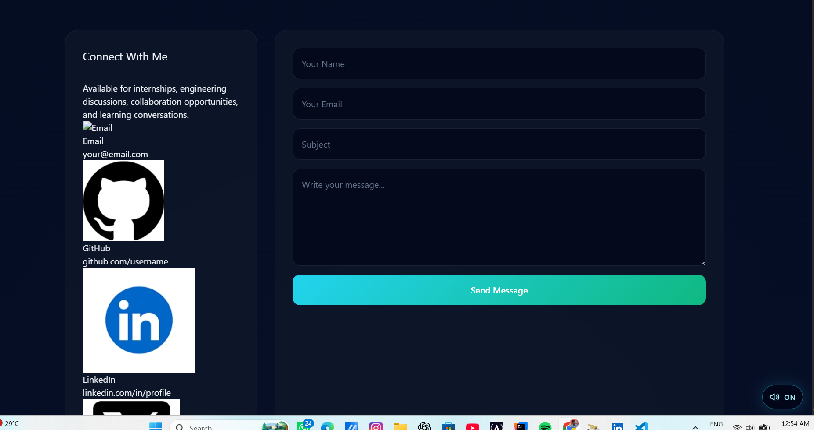


Finally, the decision was made to implement a traditional contact form backed by a serverless API.

The following files were introduced or modified:

- `frontend/components/Contact.jsx`
- `frontend/components/Navbar.jsx`
- `api/contact.js`

The serverless function was responsible for:

- Validating user input
- Sending emails through Brevo
- Returning success/error responses

---

# Phase 2 — The First Failure

The contact form looked complete.

However...

Clicking **Send Message** failed immediately.

The frontend was working.

The API was not.

---

# Phase 3 — Investigating Environment Variables

The first assumption was that the Brevo API key was not available.

Additional debugging statements were introduced into the serverless function.

The API began reporting whether environment variables actually existed.

```
githubTokenExists
brevoKeyExists
senderEmailExists
```

The result immediately exposed the issue.

GitHub variables existed.

Brevo variables did not.

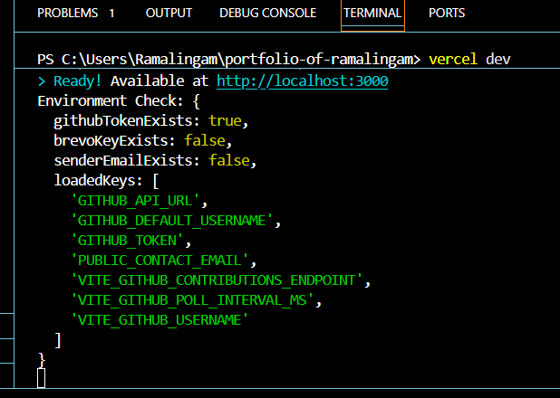

---

# Phase 4 — Local Environment vs Vercel Environment

Initially this was confusing.

The variables already existed inside:

```
.env.local
```

Therefore it appeared that the application should work.

However, the serverless runtime proved otherwise.

The variables existed locally...

...but were never loaded by the Vercel runtime.

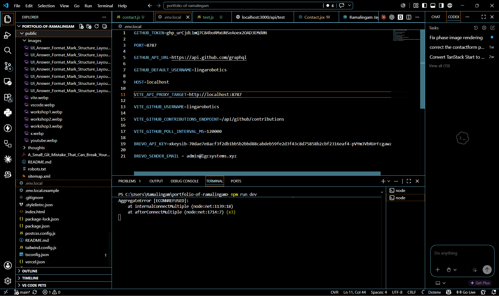

---

# Phase 5 — Auditing Vercel Environment Variables

The next step was verifying whether Vercel itself contained the required variables.

Running:

```bash
vercel env ls
```

revealed that only GitHub-related variables existed.

Brevo variables were completely absent.

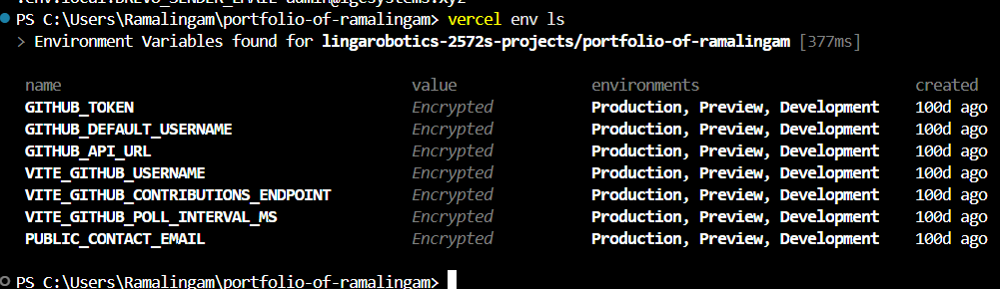

---

# Phase 6 — Adding Missing Variables

The missing variables were manually added through the Vercel Dashboard.

```
BREVO_API_KEY
BREVO_SENDER_EMAIL
```

After adding them, another audit confirmed they were now present.

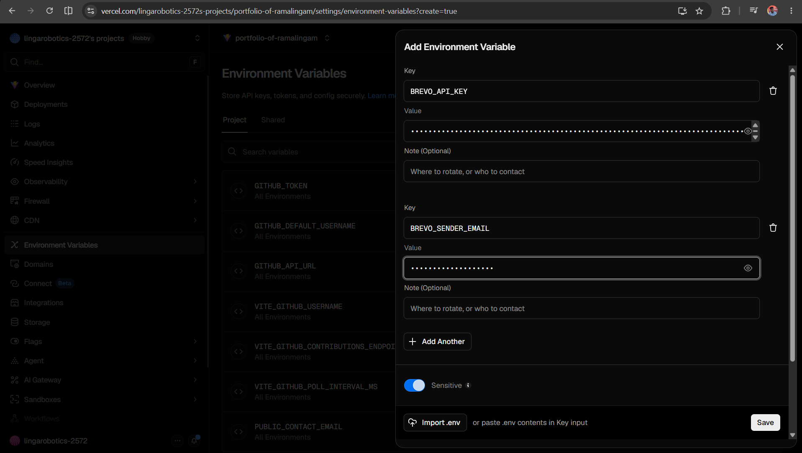

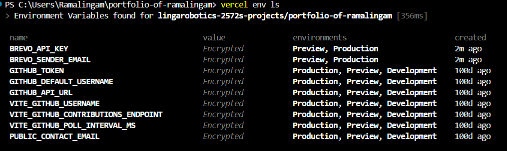

---

# Phase 7 — Deployment Failure

With the environment variables configured, the project was pushed to GitHub.

Unexpectedly...

The deployment failed.

The build logs reported:

```
SplashScreen.jsx

stream did not contain valid UTF-8
```

The issue turned out to be an invalid file encoding.

After correcting the encoding and committing the fix, the deployment succeeded.

---

# Phase 8 — Production Testing

The application was finally live.

The first production test involved submitting a message through the contact form.

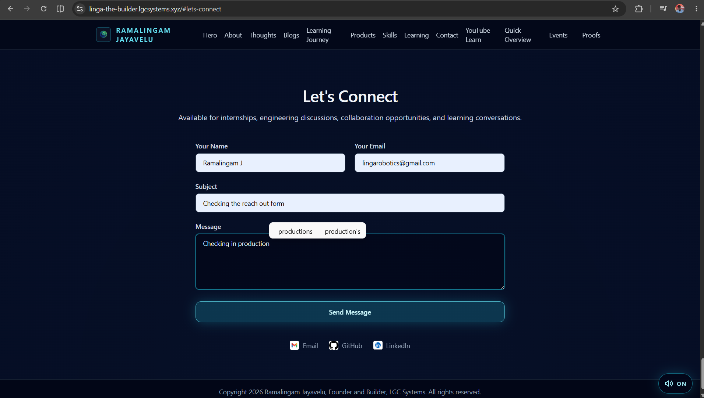

---

# Phase 9 — 401 Unauthorized

The message still failed.

Using Chrome DevTools, the request was inspected.

The API returned:

```
401 Unauthorized
```

At this stage it was no longer a frontend problem.

The request had successfully reached the backend.

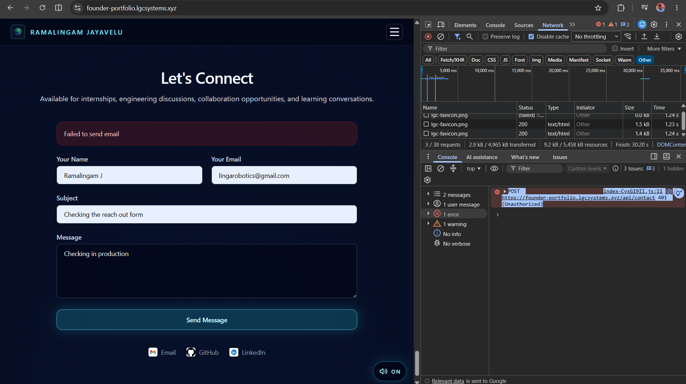

---

# Phase 10 — Inspecting the Network Response

Further inspection of the response body revealed the actual reason.

```
Unauthorized IP Address
```

Brevo was rejecting requests originating from Vercel's infrastructure.

The request path looked like this:

```
Portfolio
        ↓
Vercel Serverless Function
        ↓
Brevo API
        ↓
Rejected
```

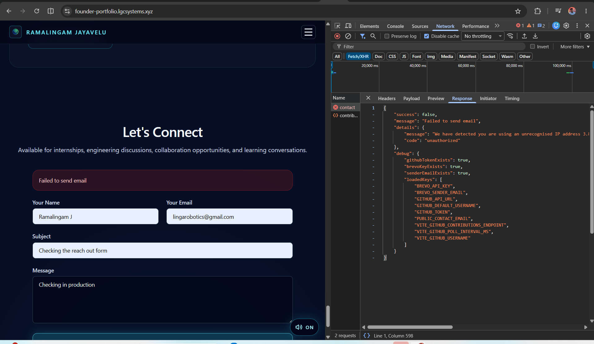

---

# Phase 11 — Brevo Security Policies

The investigation moved into Brevo.

Initially the IP address was manually authorized.

However, because serverless functions may execute from different cloud IPs, this approach would not remain reliable.

To isolate the portfolio from other projects:

- A dedicated API key was created.
- Eventually, a separate Brevo account was created exclusively for the portfolio.

---

# Phase 12 — Sender Validation

Even after creating a new Brevo account, email delivery still failed.

The Transactional Logs finally revealed the root cause.

```
Sender not validated
```

The sender email and domain were verified.

DNS records were configured.

The sender became trusted.

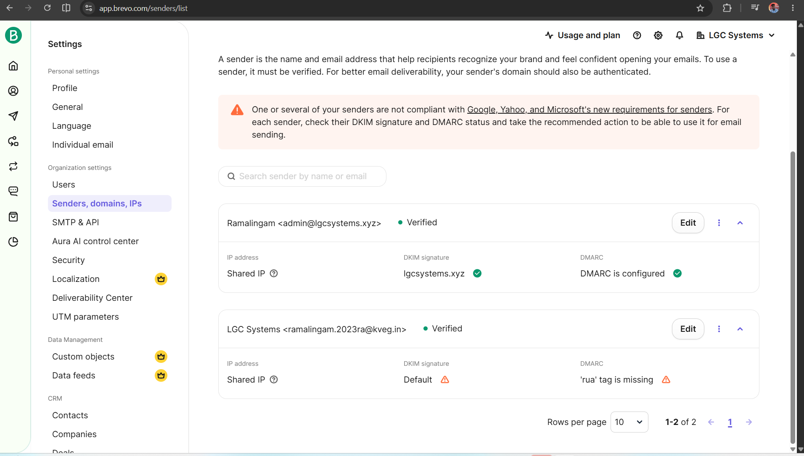

---

# Phase 13 — First Successful Submission

After sender verification...

The portfolio finally displayed:

```
Message sent!
```

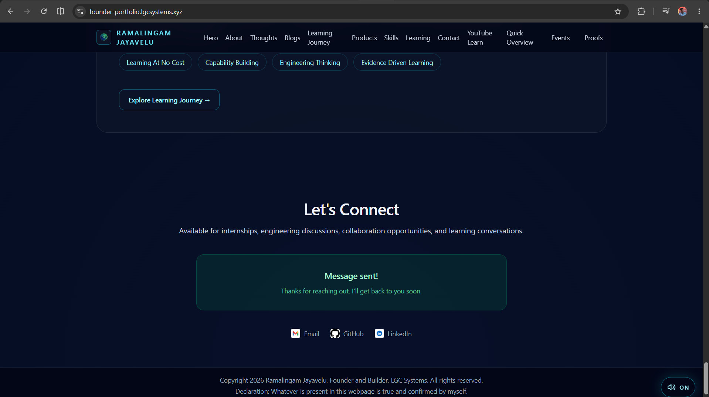

---

# Phase 14 — Email Successfully Delivered

Moments later...

The email arrived in the inbox.

The complete workflow was finally operational.

```
Visitor
      ↓
Contact Form
      ↓
React
      ↓
Vercel Serverless Function
      ↓
Brevo Transactional API
      ↓
Validated Sender
      ↓
Inbox
```

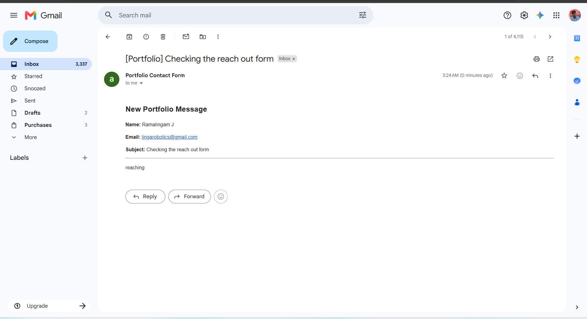

---

# Architecture

```
+-----------------------+
|   Portfolio Visitor   |
+-----------+-----------+
            |
            v
+-----------------------+
| React Contact Form    |
+-----------+-----------+
            |
            v
+-----------------------+
| /api/contact          |
| Vercel Serverless     |
+-----------+-----------+
            |
            v
+-----------------------+
| Brevo Email API       |
+-----------+-----------+
            |
            v
+-----------------------+
| Gmail Inbox           |
+-----------------------+
```

---

# Lessons Learned

This feature appeared to be a simple contact form.

Instead, it became a comprehensive debugging exercise covering:

- React frontend integration
- Vercel Serverless Functions
- Environment variable management
- Local vs Production configuration
- GitHub deployment pipeline
- UTF-8 build failures
- API authentication
- Network inspection
- Third-party API debugging
- IP authorization policies
- Sender verification
- Domain authentication
- Email deliverability

More importantly, it reinforced an engineering lesson:

> Writing the feature is often the easiest part. Building a reliable production system requires understanding every component that participates in the request lifecycle.

---

# Final Outcome

The portfolio now includes a fully functional production contact system.

Visitors can submit messages directly through the website, and those messages are securely delivered to my inbox using a serverless backend and Brevo's transactional email service.

What began as a seemingly simple feature evolved into a valuable real-world debugging case study spanning frontend development, backend services, deployment infrastructure, and production email delivery.